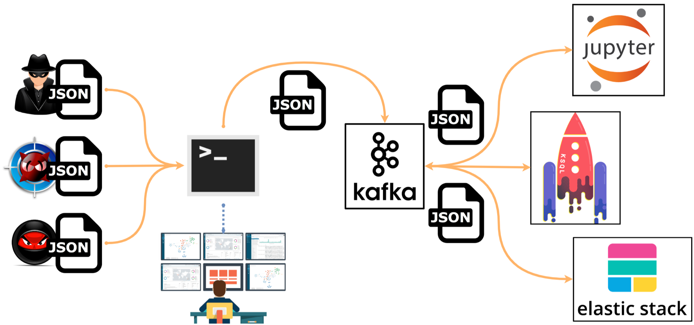

# Catapult [Alpha]

A framework to launch pre-recorded security events generated by simulated adversarial techniques to Kafka brokers. Pre-recored data is categorized by operating system, tactics and techniques defined by the Mitre [ATT&CK Framework](https://attack.mitre.org/wiki/Main_Page)

# Design

# Goals

* Provide free portable malicious datasets to expedite the development of security analytics.
* Expedite red team simulation output consumption
* Improve the testing of hunting use cases in an easier and more affordable way.
* Enable data scientists to have semi-labeled data for initial research.
* Learn more about Kafkacat and Kafka

# Current Status: Alpha

The project is currently in an alpha stage, which means that the code and the functionality are still changing. We haven't yet tested the kafka brokers in many scenarios. We invite you to try it and welcome any feedback.

# Catapult Features

* **Kafka:** A distributed publish-subscribe messaging system that is designed to be fast, scalable, fault-tolerant, and durable.
* **Kafkacat** it is a generic non-JVM producer and consumer for Apache Kafka >=0.8, think of it as a netcat for Kafka

# Resources

* [Kafka Home](http://kafka.apache.org/)
* [Kafkacat](https://github.com/edenhill/kafkacat)

# Getting Started

## WIKI

# Author

* Roberto Rodriguez [@Cyb3rWard0g](https://twitter.com/Cyb3rWard0g)

# Contributors

* Jose Luis Rodriguez [@Cyb3rPandaH](https://twitter.com/Cyb3rPandaH)

# Contributing

There are a few things that I would like to accomplish with Catapult as shown in the To-Do list below. I would love to make Catapult a stable build for everyone in the community and use it to expedite the development of securiry analytics. If you are interested on making this build a more robust one and adding some cool features to it, PLEASE feel free to submit a pull request. #SharingIsCaring

# License: GPL-3.0

[ Catapult's GNU General Public License](https://github.com/Cyb3rWard0g/Catapult/blob/master/LICENSE)

# To-Do

[ ] MacOS & Linux pre-recorded events

More coming soon...