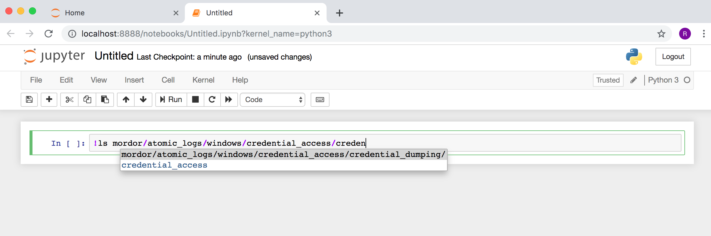
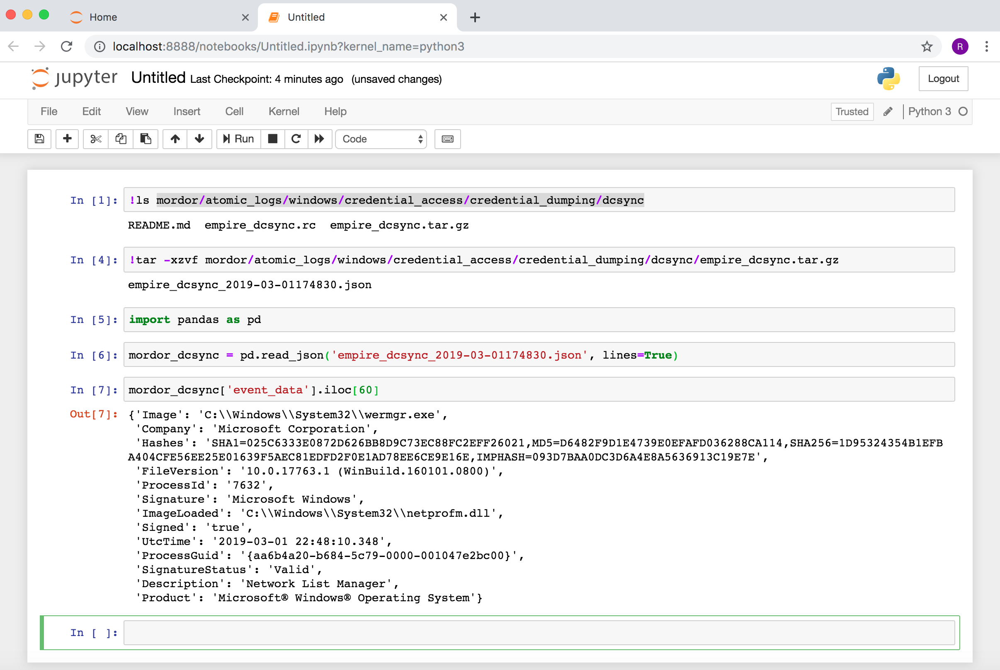

Import Mordor Data
==================

.. image:: _static/catapult-main-image.png
    :alt: Catapult
    :scale: 60%

You can simply download the json files available in this repo and start using some grep fu! if you feel like it.
However, there are other more efficient ways you can consume the pre-recorded data and even simulate a real data pipeline to ingest the data to your own SIEM or data lake.

Kafkacat Style
##############

You can start using a tool named Kafkacat to act as a Kafka producer and send data to Kafka brokers.
In producer mode, Kafkacat reads messages from standard input (stdin) or a file.
This means that you can send data back to any other Kafka broker that you are using as part of your pipeline.
You can just grab the logs from this repo and re-play them as if they were being ingested in real-time.

Requirements
************

* `Kafka Broker <http://kafka.apache.org/>`_ : A distributed publish-subscribe messaging system that is designed to be fast, scalable, fault-tolerant, and durable  (``Installed by HELK``).
* `Kafkacat <https://github.com/edenhill/kafkacat>`_ : A generic non-JVM producer and consumer for Apache Kafka >=0.8, think of it as a netcat for Kafka.
* `HELK (Basic Option) <https://www.elastic.co/elk-stack>`_ : An elastic ELK (Elasticsearch, Logstash, Kibana) stack.
* `Docker CE <https://docs.docker.com/install/>`_ : Docker Community Edition (CE) is ideal for developers and small teams looking to get started with Docker and experimenting with container-based apps (``Installed by HELK``).
* `Docker Compose <https://docs.docker.com/compose/>`_ : a tool for defining and running multi-container Docker applications (``Installed by HELK``).

.. image:: _static/kafka-kafkacat.png
    :alt: Kafkacat Infrastructure
    :scale: 35%

Consume Logs
************

.. raw:: html

    <iframe width="560" height="315" src="https://www.youtube.com/embed/ADGWxofSf4o" frameborder="0" allow="accelerometer; autoplay; encrypted-media; gyroscope; picture-in-picture" allowfullscreen></iframe>

Install Kafkacat following the `instructions from the official Kafkacat repo <https://github.com/edenhill/kafkacat#install>`_.

* If you are using a debian-based system, make sure you install the latest Kafkacat deb package.
* I recommend at least Ubuntu 18.04. You can check its `Kafkacat deb package version <https://packages.ubuntu.com/bionic/kafkacat>`_ and compare it with the latest one in the `Kafkacat GitHub repo <https://github.com/edenhill/kafkacat/releases>`_.
* You can also install it from source following the `Quick Build <https://github.com/edenhill/kafkacat#quick-build>`_ instructions.

Download and run the `HELK <https://github.com/Cyb3rWard0g/HELK>`_. Make sure you have enough memory to run the basic build.
You can run it with 5-6GB of RAM now (More information `here <https://github.com/Cyb3rWard0g/HELK/wiki/Installation>`_).

.. code-block:: console

    $ git clone https://github.com/Cyb3rWard0g/HELK.git
    $ cd HELK/docker
    $ sudo ./helk_install

Use the defaults (Option 1 and Basic license)

.. code-block:: console

    **********************************************
    **          HELK - THE HUNTING ELK          **
    **                                          **
    ** Author: Roberto Rodriguez (@Cyb3rWard0g) **
    ** HELK build version: v0.1.7-alpha02262019 **
    ** HELK ELK version: 6.6.1                  **
    ** License: GPL-3.0                         **
    **********************************************
    
    [HELK-INSTALLATION-INFO] HELK being hosted on a Linux box
    [HELK-INSTALLATION-INFO] Available Memory: 12541 MBs
    [HELK-INSTALLATION-INFO] You're using ubuntu version xenial
    
    *****************************************************
    *      HELK - Docker Compose Build Choices          *
    *****************************************************
    
    1. KAFKA + KSQL + ELK + NGNIX + ELASTALERT
    2. KAFKA + KSQL + ELK + NGNIX + ELASTALERT + SPARK + JUPYTER
    
    Enter build choice [ 1 - 2]: 1
    [HELK-INSTALLATION-INFO] HELK build set to 1
    [HELK-INSTALLATION-INFO] Set HELK elastic subscription (basic or trial): basic
    [HELK-INSTALLATION-INFO] Set HELK IP. Default value is your current IP: 192.168.64.138
    [HELK-INSTALLATION-INFO] Set HELK Kibana UI Password: hunting
    [HELK-INSTALLATION-INFO] Verify HELK Kibana UI Password: hunting
    [HELK-INSTALLATION-INFO] Installing htpasswd..
    [HELK-INSTALLATION-INFO] Installing docker via convenience script..
    [HELK-INSTALLATION-INFO] Installing docker-compose..
    [HELK-INSTALLATION-INFO] Checking local vm.max_map_count variable and setting it to 4120294
    [HELK-INSTALLATION-INFO] Building & running HELK from helk-kibana-analysis-basic.yml file..

Download the mordor repo and choose your technique:

.. code-block:: console

    $ cd ../../
    $ git clone https://github.com/Cyb3rWard0g/mordor.git
    $ cd mordor/small_datasets/windows/credential_access/credential_dumping_T1003/credentials_from_ad/

Decompress the specific mordor log file

.. code-block:: console

    $ tar -xzvf empire_dcsync.tar.gz
    x empire_dcsync_2019-03-01174830.json

Send the data to HELK via Kafcakat with the following flags:

.. function:: -b

    Kafka Broker

.. function:: -t

    Topic in the Kafka Broker to send the data to

.. function:: -P

    Producer mode

.. function:: -l

    Send messages from a file separated by delimiter, as with stdin. (only one file allowed)

.. code-block:: console

    $ kafkacat -b <HELK IP>:9092 -t winlogbeat -P -l empire_dcsync_2019-03-01174830.json

Browse to your Kibana Discover view and start going through the data

.. image:: _static/mordor-dcsync-logs.png
    :alt: DCSync
    :scale: 25%

You could look for potential DCSync actvity from a non-Domain-Controller account with the following query in Kibana:

::

    event_id:4662 NOT user_name:*$ AND object_properties:("*1131f6aa-9c07-11d1-f79f-00c04fc2dcd2*" OR "*1131f6ad-9c07-11d1-f79f-00c04fc2dcd2*" OR "*89e95b76-444d-4c62-991a-0facbeda640c*")

.. image:: _static/mordor-dcsync-found.png
    :alt: DCSync Found
    :scale: 25%

Jupyter Notebook Style
######################

You can consume mordor data directly with a Jupyter notebook and analyze it via python libraries such as Pandas.

Requirements
************

* `Docker CE <https://docs.docker.com/install/>`_ : Docker Community Edition (CE) is ideal for developers and small teams looking to get started with Docker and experimenting with container-based apps.
* `Jupyter Notebook <https://jupyter.org/>`_ : an open-source web application that allows you to create and share documents that contain live code, equations, visualizations and narrative text.

Consume Logs
************

Install docker by following the `official Docker instructions <https://docs.docker.com/install/>`_.

Download the mordor repo

.. code-block:: console

    $ git clone https://github.com/Cyb3rWard0g/mordor.git

Run a HELK dockerized **Jupyter Notebook** server and mount your mordor folder to it with the following command:

.. code-block:: console

    $ docker run -p 127.0.0.1:8888:8888 --env JUPYTER_TYPE=notebook -v $PWD/mordor:/opt/helk/jupyter/notebooks/mordor -it cyb3rward0g/helk-jupyter:0.1.2
    [HELK-JUPYTER-DOCKER-INSTALLATION-INFO] Starting Jupyter..
    [HELK-JUPYTER-DOCKER-INSTALLATION-INFO] Running Jupyter Type: notebook..
    [HELK-JUPYTER-DOCKER-INSTALLATION-INFO] Running the following parameters --ip=0.0.0.0 --port=8888 --notebook-dir=/opt/helk/jupyter/notebooks --no-browser --NotebookApp.base_url=/
    [I 03:27:32.369 NotebookApp] Writing notebook server cookie secret to /home/jupyter/.local/share/jupyter/runtime/notebook_cookie_secret
    [I 03:27:32.560 NotebookApp] JupyterLab extension loaded from /opt/conda/lib/python3.7/site-packages/jupyterlab
    [I 03:27:32.561 NotebookApp] JupyterLab application directory is /opt/conda/share/jupyter/lab
    [I 03:27:32.563 NotebookApp] Serving notebooks from local directory: /opt/helk/jupyter/notebooks
    [I 03:27:32.563 NotebookApp] The Jupyter Notebook is running at:
    [I 03:27:32.564 NotebookApp] http://(2e83a98485eb or 127.0.0.1):8888/?token=90311c8670ed2bd71f7d9e8378fdc39711ef65a0b3ed6296
    [I 03:27:32.564 NotebookApp] Use Control-C to stop this server and shut down all kernels (twice to skip confirmation).
    [C 03:27:32.568 NotebookApp] 
        
        To access the notebook, open this file in a browser:
            file:///home/jupyter/.local/share/jupyter/runtime/nbserver-76-open.html
        Or copy and paste one of these URLs:
            http://(2e83a98485eb or 127.0.0.1):8888/?token=90311c8670ed2bd71f7d9e8378fdc39711ef65a0b3ed6296

Browse to 127.0.0.1:8888 in your favorite browser and enter the token provided in the jupyter output above

.. image:: _static/jupyter-login.png
    :alt: Jupyter login
    :scale: 45%

You will be taken to the Jupyter main interface

.. image:: _static/jupyter-main-menu.png
    :alt: Jupyter main men
    :scale: 45%

Create a new notebook with kernel ``Python 3``

.. image:: _static/jupyter-new-notebook.png
    :alt: Jupyter new notebook
    :scale: 45%

You can go through the directory tree of the mordor project and even hit [TAB] for auto-completion to get to a specific technique

Create a new notebook

Decompress the mordor file you want to work with. Let's pick a dcsync example.

.. image:: _static/jupyter-decompress-file.png
    :alt: Jupyter decompress file
    :scale: 30%

Use pandas to read the file. You are ready to start exploring and analyzing the data

