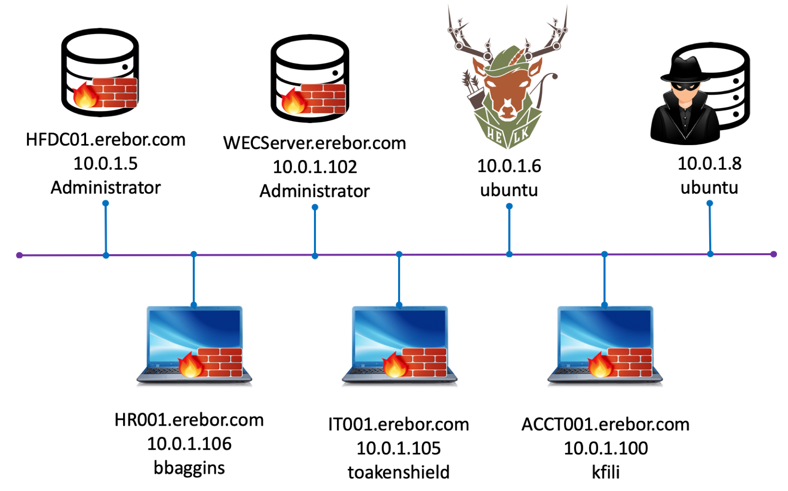

Erebor
======

This mordor environment was designed to replicate a very small network with the essential devices to colllect information from adversarial activities.
This environment is a Windows environment with SilkETW running on every endpoints to collect ETW telemetry via the event log.

Network Design
##############

Endpoints To Users
******************

+-----------+-------------+---------------+---------------------+---------------+---------------+
| Platform  | Version     | Purpose       | FQDN                | IP Address    | Main User     |
+===========+=============+===============+=====================+===============+===============+
| Windows   | Win 2019    | DC            | HFDC01.erebor.com   | 10.0.1.5      | Administrator |
+-----------+-------------+---------------+---------------------+---------------+---------------+
| Windows   | Win 10      | Client        | HR001.erebor.com    | 10.0.1.106    | bbaggins      |
+-----------+-------------+---------------+---------------------+---------------+---------------+
| Windows   | Win 10      | Client        | IT001.erebor.com    | 10.0.1.105    | toakenshield  |
+-----------+-------------+---------------+---------------------+---------------+---------------+
| Windows   | Win 10      | Client        | ACCT001.erebor.com  | 10.0.1.100    | kfili         |
+-----------+-------------+---------------+---------------------+---------------+---------------+
| Windows   | Win 2019    | Log Collector | WECServer.erebor.com| 10.0.1.102    | Administrator |
+-----------+-------------+---------------+---------------------+---------------+---------------+
| Windows   | Win 2019    | File Server   | FILE001.erebor.com  | 10.0.1.103    | Administrator |
+-----------+-------------+---------------+---------------------+---------------+---------------+
| Linux     | Ubuntu 18   | Data Analysis | HELK                | 10.0.1.6      | ubuntu        |
+-----------+-------------+---------------+---------------------+---------------+---------------+
| Linux     | Ubuntu 18   | Red Team C2   | RTO                 | 10.0.1.8      | ubuntu        |
+-----------+-------------+---------------+---------------------+---------------+---------------+

Windows Users Information
*************************

.. csv-table::
    :file: _static/erebor_users.csv
    :header-rows: 1

HELK User Information
*********************

You can update the HELK's password in the `HELK's paramaters file <https://github.com/hunters-forge/Blacksmith/blob/master/aws/mordor/cfn-parameters/erebor/helk-server-parameters.json>`_ used to deploy the environment.
This file is hosted by the project `Blacksmith <https://github.com/hunters-forge/Blacksmith>`_ since it is the official repo for all the templates used to deploy every mordor environment.

* Default Username: helk
* Default Password: hunt1ng!

Data Sources Collected
######################

SilkETW Service Conifg:

* https://github.com/hunters-forge/Blacksmith/blob/master/aws/mordor/cfn-files/configs/erebor/erebor_SilkServiceConfig.xml

I put together the image below to show you how SilkETW leverages the ETW model to enable ETW events for collection, filtering and ingestion via the event log.

.. image:: _static/mordor-erebor-silketw.png
    :alt: erebor silketw
    :scale: 35%

* It reads the contents of the provided SilkServiceConfig.xml config to identify the ETW providers it needs to enable and with what filters.
* It enables the ETW providers defined in the config file.
* It creates event trace sessions and subscribes them to the ETW providers
* It consumes events from the event trace sessions in real-time
* It writes consumed events to the SilkService-Log event log in real-time

Environment Deployment
######################

The `Blacksmith Project <https://blacksmith.readthedocs.io/en/latest/>`_ is responsible for deploying this environment.
Therefore, you can follow the instructions provided in `here <https://blacksmith.readthedocs.io/en/latest/mordor_erebor.html>`_