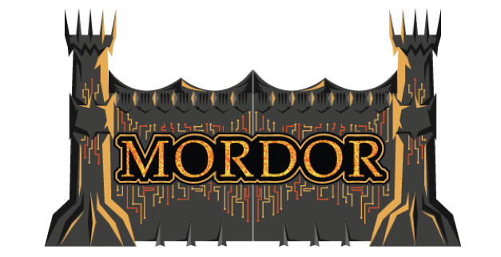

.. Mordor documentation master file, created by
   sphinx-quickstart on Sun Mar 17 20:24:51 2019.
   You can adapt this file completely to your liking, but it should at least
   contain the root `toctree` directive.

Mordor documentation
==================================

The Mordor project provides pre-recorded security events generated by simulated adversarial techniques in the form of JavaScript Object Notation (JSON) files for easy consumption.
The pre-recorded data is categorized by platforms, adversary groups, tactics and techniques defined by the Mitre `ATT&CK Framework <https://attack.mitre.org/wiki/Main_Page>`_.
The pre-recorded data represents not only specific known malicious events but additional context/events that occur around it.
This is done on purpose so that you can test creative correlations across diverse data sources, enhancing your detection strategy and potentially reducing the number of false positives in your own environment.

The name **Mordor** comes from the awesome book/film series "`The Lord of the Rings <https://en.wikipedia.org/wiki/The_Lord_of_the_Rings_(film_series)>`_", and it was a place where the evil forces of `Sauron <https://en.wikipedia.org/wiki/Sauron>`_ lived.
This repository is where data generated by known "malicious" adversarial activity lives, hence the name of the project.

.. image:: https://media.giphy.com/media/26uN0fPodsblcQ2V8S/giphy.gif
    :alt: Mordor Gates
    :width: 980px

Goals
*****

* Provide free portable datasets to expedite the development of analytics.
* Facilitate adversarial techniques simulation and output consumption.
* Allow security analysts to test their skills with real known bad data.
* Improve the validation stage of data analytics in a more efficient way.
* Enable data scientists to have semi-labeled data for initial research.
* Contribute to the `ATT&CK framework <https://attack.mitre.org/wiki/Main_Page>`_ **Data Sourcess** section.

Why Mordor?
###########

Let's say, it is Monday and you want to start your week by learning about a new adversarial technique and build detections around it.
What is the first thing that you do besides reading about the technique? If you do not have a strategy in place, you might end up asking yourself some of the following questions:

* Do I test the technique right away? If so, how do I prepare for the test? Do I build my own test or use someone else's? Do I even need to use a command and control framework (i.e Empire, Caldera)? How do I even use a command and control framework? How many technique variants do I test?
* Do I do it in production? Am I even authorized to execute random tests in production? Do I do it in a lab environment? What do I need in a lab? Do I have the right event log auditing enabled?
* How do I collect the data generated? Do I filter anything from the event logs to reduce the noise? Do I collect logs from one endpoint only? How do I share the data collected with other team members?

Do you notice that most of the questions are more related to how to produce the data rather than how to start understanding and analyzing the data to build a detection 🏹? You might be going through this without noticing.

What if you could jump straight to the analysis of the data and avoid all the hassle of preparing and setting up everything to simulate an adversarial technique.
The main goal of the project is to store and share pre-recorded datasets that you can download and replay right away.

What Do I Get With Each Mordor Dataset?
***************************************

* You get the potential relevant events and the extra context produced by other security events that get created during the time window of the log collection.
* This is valuable if you want to explore other ways to enrich your data analytic and use extra context from events from different data sources.
* For example, you also get events of the command and control communication from the endpoint which can then be mapped to the specific adversarial technique you are analyzing.
* In addition, depending on the type of dataset you use, you get more context. Learn more about them in our `documentation here <https://mordor.readthedocs.io/en/latest/mordor_datasets.html>`_.

.. toctree::
   :maxdepth: 2
   :caption: Getting Started:

   Mordor Datasets <mordor_datasets>
   Mordor Data Import <import_mordor>
   Mordor Data Export <export_mordor>

.. toctree::
   :maxdepth: 2
   :caption: Mordor Environments:

   The Shire <mordor_shire>
   Erebor <mordor_erebor>

.. toctree::
   :maxdepth: 2
   :caption: Licenses:

   GNU General Public License V3 <license>
